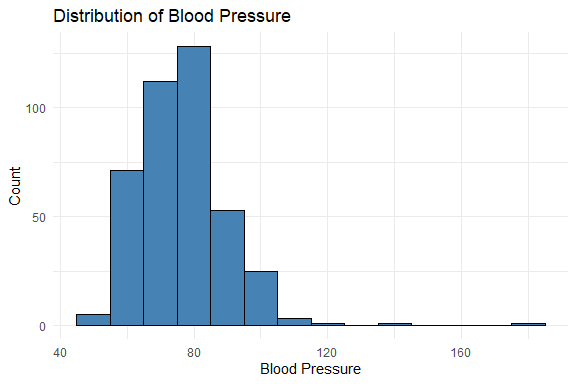
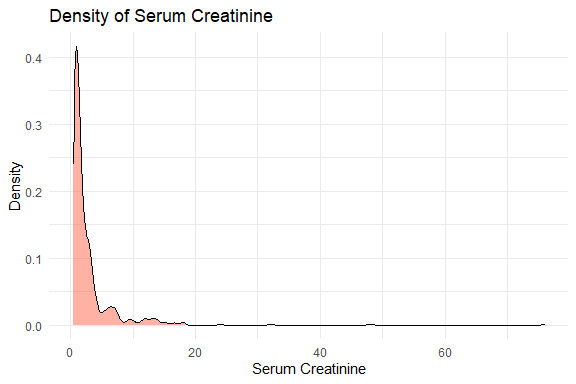
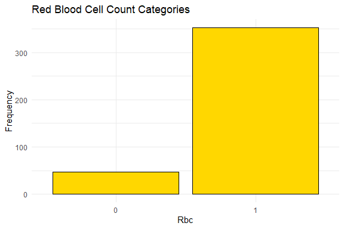
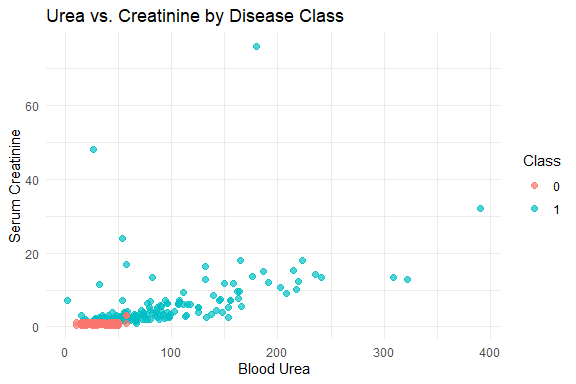
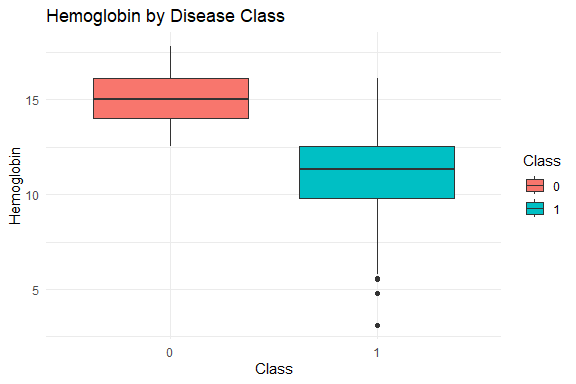
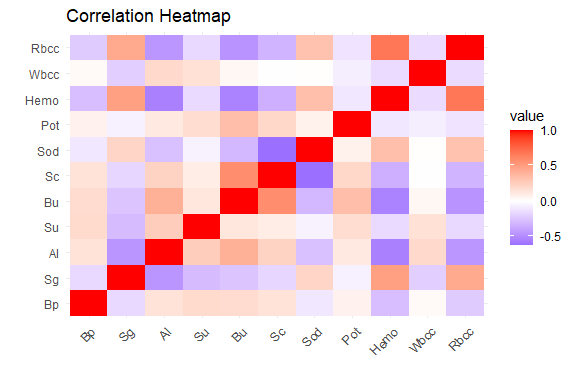
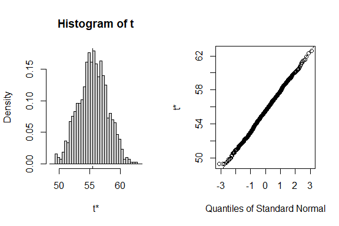

Chronic Kidney Disease Prediction
================
Trevor Okinda
2024

- [Student Details](#student-details)
- [Setup Chunk](#setup-chunk)
  - [Source:](#source)
  - [Reference:](#reference)
- [Understanding the Dataset (Exploratory Data Analysis
  (EDA))](#understanding-the-dataset-exploratory-data-analysis-eda)
  - [Loading the Dataset](#loading-the-dataset)
  - [Measures of Frequency](#measures-of-frequency)
  - [Measures of Central Tendency](#measures-of-central-tendency)
  - [Measures of Distribution](#measures-of-distribution)
  - [Measures of Relationship](#measures-of-relationship)
  - [Outputs](#outputs)
  - [ANOVA](#anova)
  - [Plots](#plots)
- [Preprocessing & Data
  Transformation](#preprocessing--data-transformation)
  - [Missing Values](#missing-values)
  - [Recode Class Values](#recode-class-values)
- [Training Models](#training-models)
  - [Data Splitting](#data-splitting)
  - [Bootstrapping](#bootstrapping)
  - [Cross-validation](#cross-validation)
  - [Training Different Models](#training-different-models)
  - [Performance Comparison Using
    resamples](#performance-comparison-using-resamples)

# Student Details

|                       |                             |
|-----------------------|-----------------------------|
| **Student ID Number** | 134780                      |
| **Student Name**      | Trevor Okinda               |
| **BBIT 4.2 Group**    | C                           |
| **Project Name**      | A Rainfall prediction model |

# Setup Chunk

**Note:** the following KnitR options have been set as the global
defaults: <BR>
`knitr::opts_chunk$set(echo = TRUE, warning = FALSE, eval = TRUE, collapse = FALSE, tidy = TRUE)`.

More KnitR options are documented here
<https://bookdown.org/yihui/rmarkdown-cookbook/chunk-options.html> and
here <https://yihui.org/knitr/options/>.

### Source:

The dataset that was used can be downloaded here: *\<<a
href="https://www.kaggle.com/datasets/abhia1999/chronic-kidney-disease/data\"
class="uri">https://www.kaggle.com/datasets/abhia1999/chronic-kidney-disease/data\</a>\>*

### Reference:

*\<Abhia1999. (2022). Chronic Kidney Disease \[Dataset\]. Kaggle. <a
href="https://www.kaggle.com/datasets/abhia1999/chronic-kidney-disease\"
class="uri">https://www.kaggle.com/datasets/abhia1999/chronic-kidney-disease\</a>\>  
Refer to the APA 7th edition manual for rules on how to cite datasets:
<https://apastyle.apa.org/style-grammar-guidelines/references/examples/data-set-references>*

# Understanding the Dataset (Exploratory Data Analysis (EDA))

## Loading the Dataset

``` r
# Load kidney disease dataset
kidney_data <- read.csv("new_model.csv", colClasses = c(
  Bp     = "numeric",
  Sg     = "numeric",
  Al     = "numeric",
  Su     = "numeric",
  Rbc    = "factor",   # Red blood cells: 0/1 or “normal”/“abnormal”
  Bu     = "numeric",  # Blood urea
  Sc     = "numeric",  # Serum creatinine
  Sod    = "numeric",  # Sodium
  Pot    = "numeric",  # Potassium
  Hemo   = "numeric",  # Hemoglobin
  Wbcc   = "numeric",  # White blood cell count
  Rbcc   = "numeric",  # Red blood cell count
  Htn    = "factor",   # Hypertension: 0/1
  Class  = "factor"    # Disease class: 0=no disease, 1=disease
), header = TRUE)

# Display the structure of the dataset
str(kidney_data)
```

    ## 'data.frame':    400 obs. of  14 variables:
    ##  $ Bp   : num  80 50 80 70 80 90 70 76 100 90 ...
    ##  $ Sg   : num  1.02 1.02 1.01 1 1.01 ...
    ##  $ Al   : num  1 4 2 4 2 3 0 2 3 2 ...
    ##  $ Su   : num  0 0 3 0 0 0 0 4 0 0 ...
    ##  $ Rbc  : Factor w/ 2 levels "0","1": 2 2 2 2 2 2 2 2 2 1 ...
    ##  $ Bu   : num  36 18 53 56 26 25 54 31 60 107 ...
    ##  $ Sc   : num  1.2 0.8 1.8 3.8 1.4 1.1 24 1.1 1.9 7.2 ...
    ##  $ Sod  : num  138 138 138 111 138 ...
    ##  $ Pot  : num  4.63 4.63 4.63 2.5 4.63 3.2 4 4.63 4.63 3.7 ...
    ##  $ Hemo : num  15.4 11.3 9.6 11.2 11.6 12.2 12.4 12.4 10.8 9.5 ...
    ##  $ Wbcc : num  7800 6000 7500 6700 7300 ...
    ##  $ Rbcc : num  5.2 4.71 4.71 3.9 4.6 4.4 4.71 5 4 3.7 ...
    ##  $ Htn  : Factor w/ 3 levels "0","0.37","1": 3 1 1 3 1 3 1 1 3 3 ...
    ##  $ Class: Factor w/ 2 levels "0","1": 2 2 2 2 2 2 2 2 2 2 ...

``` r
# View the first few rows of the dataset
head(kidney_data)
```

    ##   Bp    Sg Al Su Rbc Bu  Sc    Sod  Pot Hemo Wbcc Rbcc Htn Class
    ## 1 80 1.020  1  0   1 36 1.2 137.53 4.63 15.4 7800 5.20   1     1
    ## 2 50 1.020  4  0   1 18 0.8 137.53 4.63 11.3 6000 4.71   0     1
    ## 3 80 1.010  2  3   1 53 1.8 137.53 4.63  9.6 7500 4.71   0     1
    ## 4 70 1.005  4  0   1 56 3.8 111.00 2.50 11.2 6700 3.90   1     1
    ## 5 80 1.010  2  0   1 26 1.4 137.53 4.63 11.6 7300 4.60   0     1
    ## 6 90 1.015  3  0   1 25 1.1 142.00 3.20 12.2 7800 4.40   1     1

``` r
# Open the dataset in a viewer window (in RStudio)
View(kidney_data)
```

## Measures of Frequency

``` r
# Load necessary library
library(dplyr)
```

    ## 
    ## Attaching package: 'dplyr'

    ## The following objects are masked from 'package:stats':
    ## 
    ##     filter, lag

    ## The following objects are masked from 'package:base':
    ## 
    ##     intersect, setdiff, setequal, union

``` r
# 1. Measures of Frequency
#    Count occurrences for each level of each factor column
freq_Rbc   <- kidney_data %>% count(Rbc, name = "Freq")
freq_Htn   <- kidney_data %>% count(Htn, name = "Freq")
freq_Class <- kidney_data %>% count(Class, name = "Freq")
```

## Measures of Central Tendency

``` r
# 2. Measures of Central Tendency
#    Compute mean, median, and mode for numeric columns
numeric_cols <- kidney_data %>% select(where(is.numeric))
central_tendency <- numeric_cols %>% summarize_all(list(
  Mean   = ~ mean(. , na.rm = TRUE),
  Median = ~ median(. , na.rm = TRUE),
  Mode   = ~ {
    ux <- unique(.,   na.rm = TRUE)
    ux[which.max(tabulate(match(., ux)))]
  }
))
```

## Measures of Distribution

``` r
# 3. Measures of Distribution
#    Min, Max, Range, Standard Deviation, and Quantiles 
distribution_measures <- numeric_cols %>% summarize_all(list(
  Min    = ~ min(. , na.rm = TRUE),
  Max    = ~ max(. , na.rm = TRUE),
  Range  = ~ diff(range(. , na.rm = TRUE)),
  SD     = ~ sd(. , na.rm = TRUE),
  Q1     = ~ quantile(. , 0.25, na.rm = TRUE),
  Q3     = ~ quantile(. , 0.75, na.rm = TRUE)
))
```

## Measures of Relationship

``` r
# 4. Measures of Relationship
#    Correlation matrix for numeric variables
correlation_matrix <- cor(numeric_cols, use = "pairwise.complete.obs")
```

## Outputs

``` r
# Print outputs
freq_Rbc; freq_Htn; freq_Class
```

    ##   Rbc Freq
    ## 1   0   47
    ## 2   1  353

    ##    Htn Freq
    ## 1    0  251
    ## 2 0.37    2
    ## 3    1  147

    ##   Class Freq
    ## 1     0  150
    ## 2     1  250

``` r
central_tendency
```

    ##   Bp_Mean  Sg_Mean Al_Mean Su_Mean Bu_Mean Sc_Mean Sod_Mean Pot_Mean Hemo_Mean
    ## 1  76.455 1.017713   1.015   0.395 57.4055 3.07235  137.529  4.62785   12.5269
    ##   Wbcc_Mean Rbcc_Mean Bp_Median Sg_Median Al_Median Su_Median Bu_Median
    ## 1   8406.09  4.708275        78      1.02         1         0        44
    ##   Sc_Median Sod_Median Pot_Median Hemo_Median Wbcc_Median Rbcc_Median Bp_Mode
    ## 1       1.4     137.53       4.63       12.53        8406        4.71      80
    ##   Sg_Mode Al_Mode Su_Mode Bu_Mode Sc_Mode Sod_Mode Pot_Mode Hemo_Mode Wbcc_Mode
    ## 1    1.02       0       0      57     1.2   137.53     4.63     12.53      8406
    ##   Rbcc_Mode
    ## 1      4.71

``` r
distribution_measures
```

    ##   Bp_Min Sg_Min Al_Min Su_Min Bu_Min Sc_Min Sod_Min Pot_Min Hemo_Min Wbcc_Min
    ## 1     50  1.005      0      0    1.5    0.4     4.5     2.5      3.1     2200
    ##   Rbcc_Min Bp_Max Sg_Max Al_Max Su_Max Bu_Max Sc_Max Sod_Max Pot_Max Hemo_Max
    ## 1      2.1    180  1.025      5      5    391     76     163      47     17.8
    ##   Wbcc_Max Rbcc_Max Bp_Range Sg_Range Al_Range Su_Range Bu_Range Sc_Range
    ## 1    26400        8      130     0.02        5        5    389.5     75.6
    ##   Sod_Range Pot_Range Hemo_Range Wbcc_Range Rbcc_Range    Bp_SD       Sg_SD
    ## 1     158.5      44.5       14.7      24200        5.9 13.47654 0.005434028
    ##      Al_SD    Su_SD    Bu_SD   Sc_SD   Sod_SD   Pot_SD  Hemo_SD Wbcc_SD
    ## 1 1.272329 1.040038 49.28597 5.61749 9.204273 2.819783 2.716171 2523.22
    ##     Rbcc_SD Bp_Q1 Sg_Q1 Al_Q1 Su_Q1 Bu_Q1 Sc_Q1 Sod_Q1 Pot_Q1 Hemo_Q1 Wbcc_Q1
    ## 1 0.8403152    70 1.015     0     0    27   0.9    135      4  10.875    6975
    ##   Rbcc_Q1 Bp_Q3 Sg_Q3 Al_Q3 Su_Q3 Bu_Q3 Sc_Q3 Sod_Q3 Pot_Q3 Hemo_Q3 Wbcc_Q3
    ## 1     4.5    80  1.02     2     0 61.75  3.07    141    4.8  14.625    9400
    ##   Rbcc_Q3
    ## 1     5.1

``` r
correlation_matrix
```

    ##               Bp          Sg         Al          Su          Bu           Sc
    ## Bp    1.00000000 -0.16405728  0.1460603  0.19027692  0.18417277  0.144468967
    ## Sg   -0.16405728  1.00000000 -0.4608347 -0.29205268 -0.24926340 -0.176141212
    ## Al    0.14606028 -0.46083467  1.0000000  0.26256421  0.40503476  0.229396300
    ## Su    0.19027692 -0.29205268  0.2625642  1.00000000  0.12607440  0.094567757
    ## Bu    0.18417277 -0.24926340  0.4050348  0.12607440  1.00000000  0.581176394
    ## Sc    0.14446897 -0.17614121  0.2293963  0.09456776  0.58117639  1.000000000
    ## Sod  -0.10338349  0.21745589 -0.2707089 -0.05344771 -0.30735729 -0.624493283
    ## Pot   0.06679114 -0.06344956  0.1144842  0.18009786  0.33695368  0.205361262
    ## Hemo -0.27944074  0.49210289 -0.5486815 -0.15687458 -0.54069883 -0.342053165
    ## Wbcc  0.02596281 -0.20688017  0.2006637  0.15903349  0.04152983 -0.005419845
    ## Rbcc -0.22082730  0.44343730 -0.4541313 -0.16382512 -0.46594701 -0.323055625
    ##              Sod         Pot       Hemo         Wbcc       Rbcc
    ## Bp   -0.10338349  0.06679114 -0.2794407  0.025962807 -0.2208273
    ## Sg    0.21745589 -0.06344956  0.4921029 -0.206880172  0.4434373
    ## Al   -0.27070889  0.11448419 -0.5486815  0.200663718 -0.4541313
    ## Su   -0.05344771  0.18009786 -0.1568746  0.159033486 -0.1638251
    ## Bu   -0.30735729  0.33695368 -0.5406988  0.041529831 -0.4659470
    ## Sc   -0.62449328  0.20536126 -0.3420532 -0.005419845 -0.3230556
    ## Sod   1.00000000  0.06741381  0.3336038  0.006334350  0.3168835
    ## Pot   0.06741381  1.00000000 -0.1006116 -0.074057470 -0.1204179
    ## Hemo  0.33360385 -0.10061163  1.0000000 -0.153805674  0.6818642
    ## Wbcc  0.00633435 -0.07405747 -0.1538057  1.000000000 -0.1513796
    ## Rbcc  0.31688349 -0.12041793  0.6818642 -0.151379552  1.0000000

## ANOVA

``` r
# Load necessary package
library(dplyr)
library(broom)  # for tidy()

# 1. Identify numeric columns
numeric_vars <- kidney_data %>%
  select(where(is.numeric)) %>%
  names()

# 2. Function to run ANOVA for one variable
run_anova <- function(var_name) {
  formula <- as.formula(paste(var_name, "~ Class"))
  aov_res  <- aov(formula, data = kidney_data)
  tidy_res <- tidy(aov_res)
  # Extract the term row for 'Class'
  class_row <- tidy_res %>% filter(term == "Class")
  # Append variable name
  class_row$variable <- var_name
  class_row
}

# 3. Apply across all numeric variables
anova_results <- lapply(numeric_vars, run_anova) %>%
  bind_rows() %>%
  select(variable, df, statistic, p.value)

# 4. View results
print(anova_results)
```

    ## # A tibble: 11 × 4
    ##    variable    df statistic  p.value
    ##    <chr>    <dbl>     <dbl>    <dbl>
    ##  1 Bp           1     36.6  3.37e- 9
    ##  2 Sg           1    306.   2.80e-51
    ##  3 Al           1    222.   3.26e-40
    ##  4 Su           1     37.8  1.90e- 9
    ##  5 Bu           1     63.9  1.42e-14
    ##  6 Sc           1     37.7  2.02e- 9
    ##  7 Sod          1     52.8  1.96e-12
    ##  8 Pot          1      2.38 1.24e- 1
    ##  9 Hemo         1    453.   1.19e-67
    ## 10 Wbcc         1     17.5  3.52e- 5
    ## 11 Rbcc         1    213.   6.48e-39

## Plots

``` r
# Load libraries
library(ggplot2)
library(GGally)
```

    ## Registered S3 method overwritten by 'GGally':
    ##   method from   
    ##   +.gg   ggplot2

``` r
# Univariate Plots

# 1. Histogram of Blood Pressure (Bp)
ggplot(kidney_data, aes(x = Bp)) +
  geom_histogram(binwidth = 10, fill = "steelblue", color = "black") +
  labs(title = "Distribution of Blood Pressure", x = "Blood Pressure", y = "Count") +
  theme_minimal()
```

<!-- -->

``` r
# 2. Density plot of Serum Creatinine (Sc)
ggplot(kidney_data, aes(x = Sc)) +
  geom_density(fill = "tomato", alpha = 0.5) +
  labs(title = "Density of Serum Creatinine", x = "Serum Creatinine", y = "Density") +
  theme_minimal()
```

<!-- -->

``` r
# 3. Bar chart of Red Blood Cell count category (Rbc)
ggplot(kidney_data, aes(x = Rbc)) +
  geom_bar(fill = "gold", color = "black") +
  labs(title = "Red Blood Cell Count Categories", x = "Rbc", y = "Frequency") +
  theme_minimal()
```

<!-- -->

``` r
# Multivariate Plots

# 1. Scatter plot of Urea (Bu) vs. Creatinine (Sc) colored by Class
ggplot(kidney_data, aes(x = Bu, y = Sc, color = Class)) +
  geom_point(alpha = 0.7, size = 2) +
  labs(title = "Urea vs. Creatinine by Disease Class", x = "Blood Urea", y = "Serum Creatinine") +
  theme_minimal()
```

<!-- -->

``` r
# 2. Boxplots of Hemoglobin (Hemo) by Disease Class
ggplot(kidney_data, aes(x = Class, y = Hemo, fill = Class)) +
  geom_boxplot() +
  labs(title = "Hemoglobin by Disease Class", x = "Class", y = "Hemoglobin") +
  theme_minimal()
```

<!-- -->

``` r
# 4. Heatmap of correlation matrix
corr_mat <- cor(kidney_data %>% select(where(is.numeric)), use = "pairwise.complete.obs")
library(reshape2)
melted_corr <- reshape2::melt(corr_mat)
ggplot(melted_corr, aes(x = Var1, y = Var2, fill = value)) +
  geom_tile() +
  scale_fill_gradient2(low = "blue", mid = "white", high = "red", midpoint = 0) +
  labs(title = "Correlation Heatmap", x = "", y = "") +
  theme_minimal() +
  theme(axis.text.x = element_text(angle = 45, hjust = 1))
```

<!-- -->

# Preprocessing & Data Transformation

## Missing Values

``` r
# 1. Total missing values in the entire data frame
total_missing <- sum(is.na(kidney_data))
print(paste("Total missing values:", total_missing))
```

    ## [1] "Total missing values: 0"

``` r
# 2. Missing values per column
missing_by_column <- colSums(is.na(kidney_data))
print("Missing values by column:")
```

    ## [1] "Missing values by column:"

``` r
print(missing_by_column)
```

    ##    Bp    Sg    Al    Su   Rbc    Bu    Sc   Sod   Pot  Hemo  Wbcc  Rbcc   Htn 
    ##     0     0     0     0     0     0     0     0     0     0     0     0     0 
    ## Class 
    ##     0

``` r
# 3. Percentage of missing values per column
missing_pct <- round(100 * missing_by_column / nrow(kidney_data), 2)
print("Percentage of missing values by column:")
```

    ## [1] "Percentage of missing values by column:"

``` r
print(missing_pct)
```

    ##    Bp    Sg    Al    Su   Rbc    Bu    Sc   Sod   Pot  Hemo  Wbcc  Rbcc   Htn 
    ##     0     0     0     0     0     0     0     0     0     0     0     0     0 
    ## Class 
    ##     0

``` r
# 4. Visual check with naniar (optional)
if (!requireNamespace("naniar", quietly = TRUE)) {
  install.packages("naniar")
}
library(naniar)
# Plot a missingness map
vis_miss(kidney_data)
```

<!-- -->

## Recode Class Values

``` r
# Recode the factor levels of the target variable
levels(kidney_data$Class) <- c("Negative", "Positive")

# Check the levels again to confirm
levels(kidney_data$Class)
```

    ## [1] "Negative" "Positive"

# Training Models

## Data Splitting

``` r
# Load required libraries
library(caret)
```

    ## Loading required package: lattice

``` r
library(boot)
```

    ## 
    ## Attaching package: 'boot'

    ## The following object is masked from 'package:lattice':
    ## 
    ##     melanoma

``` r
set.seed(123)

# 1. Data Splitting (80% train, 20% test)
train_index <- createDataPartition(kidney_data$Class, p = 0.8, list = FALSE)
train_data  <- kidney_data[train_index, ]
test_data   <- kidney_data[-train_index, ]

dim(test_data)
```

    ## [1] 80 14

``` r
dim(train_data)
```

    ## [1] 320  14

## Bootstrapping

``` r
# 2. Bootstrapping on the training data
#    Define a statistic function, e.g., mean of Blood Urea (Bu)
boot_mean_bu <- function(data, indices) {
  sampled <- data[indices, ]
  return(mean(sampled$Bu, na.rm = TRUE))
}

#    Perform bootstrapping: 1000 resamples
boot_results <- boot(data = train_data, statistic = boot_mean_bu, R = 1000)

# 3. View Bootstrapping Results
print(boot_results)
```

    ## 
    ## ORDINARY NONPARAMETRIC BOOTSTRAP
    ## 
    ## 
    ## Call:
    ## boot(data = train_data, statistic = boot_mean_bu, R = 1000)
    ## 
    ## 
    ## Bootstrap Statistics :
    ##     original     bias    std. error
    ## t1* 55.45375 0.05871875    2.350194

``` r
# 4. Bootstrap Confidence Interval for the mean Bu
boot_ci <- boot.ci(boot_results, type = c("norm", "basic", "perc"))
print(boot_ci)
```

    ## BOOTSTRAP CONFIDENCE INTERVAL CALCULATIONS
    ## Based on 1000 bootstrap replicates
    ## 
    ## CALL : 
    ## boot.ci(boot.out = boot_results, type = c("norm", "basic", "perc"))
    ## 
    ## Intervals : 
    ## Level      Normal              Basic              Percentile     
    ## 95%   (50.79, 60.00 )   (50.85, 59.95 )   (50.96, 60.06 )  
    ## Calculations and Intervals on Original Scale

``` r
# 5. (Optional) Plot the bootstrap distribution
plot(boot_results)
```

<!-- -->

## Cross-validation

``` r
# Load necessary libraries
library(caret)
library(randomForest)
```

    ## randomForest 4.7-1.1

    ## Type rfNews() to see new features/changes/bug fixes.

    ## 
    ## Attaching package: 'randomForest'

    ## The following object is masked from 'package:ggplot2':
    ## 
    ##     margin

    ## The following object is masked from 'package:dplyr':
    ## 
    ##     combine

``` r
library(e1071)  # For other classifiers if needed

# Split the data into training and testing sets
set.seed(123)
trainIndex <- createDataPartition(kidney_data$Class, p = 0.8, list = FALSE)
train_data <- kidney_data[trainIndex, ]
test_data <- kidney_data[-trainIndex, ]

# Set up cross-validation (repeated k-fold)
ctrl <- trainControl(method = "repeatedcv", 
                     number = 10,  # 10-fold cross-validation
                     repeats = 3,  # Repeat the process 3 times
                     classProbs = TRUE,  # For classification, need class probabilities
                     summaryFunction = twoClassSummary)  # To track ROC, Sensitivity, etc.

print(ctrl)
```

    ## $method
    ## [1] "repeatedcv"
    ## 
    ## $number
    ## [1] 10
    ## 
    ## $repeats
    ## [1] 3
    ## 
    ## $search
    ## [1] "grid"
    ## 
    ## $p
    ## [1] 0.75
    ## 
    ## $initialWindow
    ## NULL
    ## 
    ## $horizon
    ## [1] 1
    ## 
    ## $fixedWindow
    ## [1] TRUE
    ## 
    ## $skip
    ## [1] 0
    ## 
    ## $verboseIter
    ## [1] FALSE
    ## 
    ## $returnData
    ## [1] TRUE
    ## 
    ## $returnResamp
    ## [1] "final"
    ## 
    ## $savePredictions
    ## [1] FALSE
    ## 
    ## $classProbs
    ## [1] TRUE
    ## 
    ## $summaryFunction
    ## function (data, lev = NULL, model = NULL) 
    ## {
    ##     if (length(lev) > 2) {
    ##         stop(paste("Your outcome has", length(lev), "levels. The twoClassSummary() function isn't appropriate."))
    ##     }
    ##     requireNamespaceQuietStop("pROC")
    ##     if (!all(levels(data[, "pred"]) == lev)) {
    ##         stop("levels of observed and predicted data do not match")
    ##     }
    ##     rocObject <- try(pROC::roc(data$obs, data[, lev[1]], direction = ">", 
    ##         quiet = TRUE), silent = TRUE)
    ##     rocAUC <- if (inherits(rocObject, "try-error")) 
    ##         NA
    ##     else rocObject$auc
    ##     out <- c(rocAUC, sensitivity(data[, "pred"], data[, "obs"], 
    ##         lev[1]), specificity(data[, "pred"], data[, "obs"], lev[2]))
    ##     names(out) <- c("ROC", "Sens", "Spec")
    ##     out
    ## }
    ## <bytecode: 0x000001e52ee7ae18>
    ## <environment: namespace:caret>
    ## 
    ## $selectionFunction
    ## [1] "best"
    ## 
    ## $preProcOptions
    ## $preProcOptions$thresh
    ## [1] 0.95
    ## 
    ## $preProcOptions$ICAcomp
    ## [1] 3
    ## 
    ## $preProcOptions$k
    ## [1] 5
    ## 
    ## $preProcOptions$freqCut
    ## [1] 19
    ## 
    ## $preProcOptions$uniqueCut
    ## [1] 10
    ## 
    ## $preProcOptions$cutoff
    ## [1] 0.9
    ## 
    ## 
    ## $sampling
    ## NULL
    ## 
    ## $index
    ## NULL
    ## 
    ## $indexOut
    ## NULL
    ## 
    ## $indexFinal
    ## NULL
    ## 
    ## $timingSamps
    ## [1] 0
    ## 
    ## $predictionBounds
    ## [1] FALSE FALSE
    ## 
    ## $seeds
    ## [1] NA
    ## 
    ## $adaptive
    ## $adaptive$min
    ## [1] 5
    ## 
    ## $adaptive$alpha
    ## [1] 0.05
    ## 
    ## $adaptive$method
    ## [1] "gls"
    ## 
    ## $adaptive$complete
    ## [1] TRUE
    ## 
    ## 
    ## $trim
    ## [1] FALSE
    ## 
    ## $allowParallel
    ## [1] TRUE

## Training Different Models

``` r
# Re-split the data since we modified the original dataset
set.seed(123)
trainIndex <- createDataPartition(kidney_data$Class, p = 0.8, list = FALSE)
train_data <- kidney_data[trainIndex, ]
test_data  <- kidney_data[-trainIndex, ]

# Train the logistic regression model again
logistic_model <- train(Class ~ ., 
                        data = train_data, 
                        method = "glm", 
                        family = "binomial", 
                        trControl = ctrl, 
                        metric = "ROC")

# Print model summary
print(logistic_model)
```

    ## Generalized Linear Model 
    ## 
    ## 320 samples
    ##  13 predictor
    ##   2 classes: 'Negative', 'Positive' 
    ## 
    ## No pre-processing
    ## Resampling: Cross-Validated (10 fold, repeated 3 times) 
    ## Summary of sample sizes: 288, 288, 288, 288, 288, 288, ... 
    ## Resampling results:
    ## 
    ##   ROC        Sens       Spec     
    ##   0.9795139  0.9638889  0.9616667

``` r
# Train a random forest model
rf_model <- train(Class ~ ., 
                  data = train_data, 
                  method = "rf", 
                  trControl = ctrl, 
                  metric = "ROC")  # Use ROC for performance evaluation

# Print the results of the random forest model
print(rf_model)
```

    ## Random Forest 
    ## 
    ## 320 samples
    ##  13 predictor
    ##   2 classes: 'Negative', 'Positive' 
    ## 
    ## No pre-processing
    ## Resampling: Cross-Validated (10 fold, repeated 3 times) 
    ## Summary of sample sizes: 288, 288, 288, 288, 288, 288, ... 
    ## Resampling results across tuning parameters:
    ## 
    ##   mtry  ROC        Sens       Spec     
    ##    2    0.9998611  0.9833333  0.9966667
    ##    8    0.9995833  0.9777778  0.9950000
    ##   14    0.9981944  0.9750000  0.9900000
    ## 
    ## ROC was used to select the optimal model using the largest value.
    ## The final value used for the model was mtry = 2.

``` r
# Train a Support Vector Machine (SVM) with radial basis function kernel
svm_model <- train(Class ~ ., 
                   data = train_data,
                   method = "svmRadial",
                   trControl = ctrl,
                   metric = "ROC",
                   preProcess = c("center", "scale"),  # SVM benefits from feature scaling
                   tuneLength = 10)  # Try different combinations of hyperparameters

# Print the model summary
print(svm_model)
```

    ## Support Vector Machines with Radial Basis Function Kernel 
    ## 
    ## 320 samples
    ##  13 predictor
    ##   2 classes: 'Negative', 'Positive' 
    ## 
    ## Pre-processing: centered (14), scaled (14) 
    ## Resampling: Cross-Validated (10 fold, repeated 3 times) 
    ## Summary of sample sizes: 288, 288, 288, 288, 288, 288, ... 
    ## Resampling results across tuning parameters:
    ## 
    ##   C       ROC        Sens       Spec     
    ##     0.25  0.9997222  0.9944444  0.9866667
    ##     0.50  0.9997222  0.9944444  0.9883333
    ##     1.00  0.9997222  0.9888889  0.9900000
    ##     2.00  0.9995833  0.9805556  0.9866667
    ##     4.00  0.9995833  0.9777778  0.9833333
    ##     8.00  0.9995833  0.9833333  0.9833333
    ##    16.00  0.9991667  0.9777778  0.9783333
    ##    32.00  0.9990278  0.9611111  0.9800000
    ##    64.00  0.9990278  0.9666667  0.9783333
    ##   128.00  0.9988889  0.9694444  0.9750000
    ## 
    ## Tuning parameter 'sigma' was held constant at a value of 0.1207201
    ## ROC was used to select the optimal model using the largest value.
    ## The final values used for the model were sigma = 0.1207201 and C = 0.25.

## Performance Comparison Using resamples

``` r
# Load caret and lattice if not already loaded
library(caret)
library(lattice)

# Compare model performance using resamples
model_comparison <- resamples(list(
  Logistic = logistic_model,
  RandomForest = rf_model,
  SVM = svm_model
))

# Summary of resampling statistics
summary(model_comparison)
```

    ## 
    ## Call:
    ## summary.resamples(object = model_comparison)
    ## 
    ## Models: Logistic, RandomForest, SVM 
    ## Number of resamples: 30 
    ## 
    ## ROC 
    ##                   Min.   1st Qu. Median      Mean 3rd Qu. Max. NA's
    ## Logistic     0.9291667 0.9677083  0.975 0.9795139       1    1    0
    ## RandomForest 0.9958333 1.0000000  1.000 0.9998611       1    1    0
    ## SVM          0.9958333 1.0000000  1.000 0.9997222       1    1    0
    ## 
    ## Sens 
    ##                   Min.   1st Qu. Median      Mean 3rd Qu. Max. NA's
    ## Logistic     0.8333333 0.9166667      1 0.9638889       1    1    0
    ## RandomForest 0.8333333 1.0000000      1 0.9833333       1    1    0
    ## SVM          0.9166667 1.0000000      1 0.9944444       1    1    0
    ## 
    ## Spec 
    ##              Min. 1st Qu. Median      Mean 3rd Qu. Max. NA's
    ## Logistic     0.85    0.95   0.95 0.9616667       1    1    0
    ## RandomForest 0.95    1.00   1.00 0.9966667       1    1    0
    ## SVM          0.90    1.00   1.00 0.9866667       1    1    0

``` r
# Boxplots to compare performance metrics
bwplot(model_comparison, metric = "ROC")
```

<!-- -->

``` r
bwplot(model_comparison, metric = "Sens")
```

<!-- -->

``` r
bwplot(model_comparison, metric = "Spec")
```

<!-- -->

``` r
# Dotplot for an overall visual comparison
dotplot(model_comparison, metric = "ROC")
```

<!-- -->
